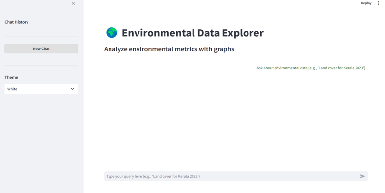
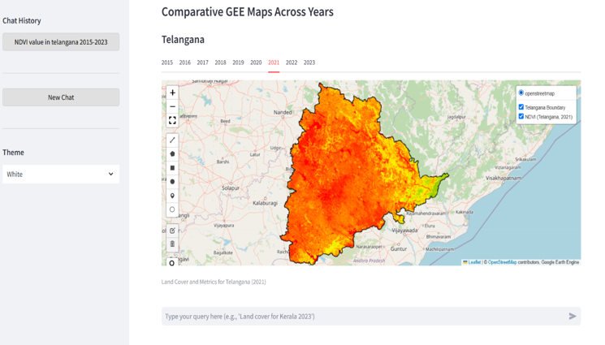
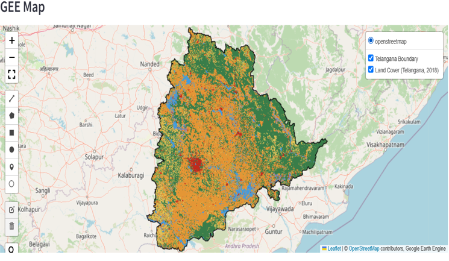
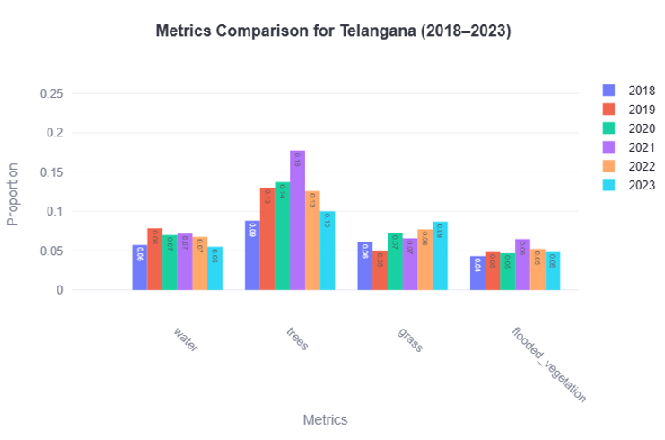
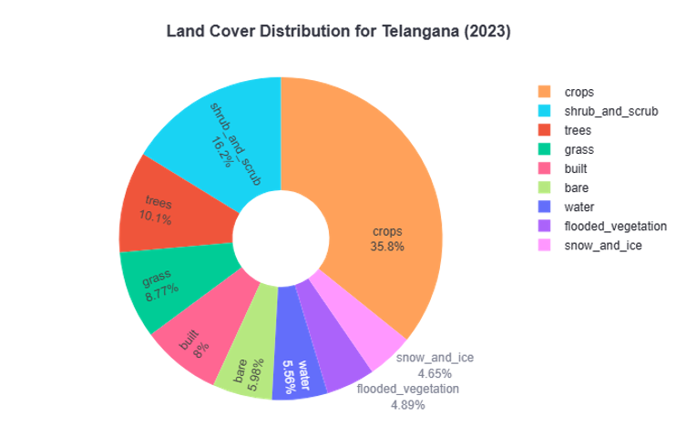
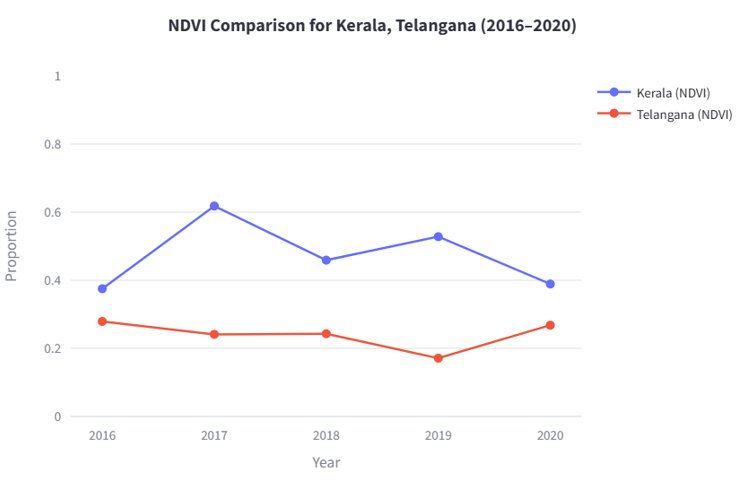

# AI-Powered-Geospatial-Analytics-for-Environmental-Transformations

This repository contains the source code for a Mini Project developed. The project, titled **"AI-Powered Geospatial Analytics for Environmental Transformations"**, integrates advanced large language models (LLMs) like Mistral-saba and Gemini with Google Earth Engine (GEE) to monitor and analyze environmental changes across India from 2015 to 2025.

The system enables users to query environmental metrics (e.g., NDVI, NBR, EVI, MNDWI, land cover) in natural language, generating detailed reports, interactive visualizations (bar charts, pie charts, line graphs), and geospatial maps. Built with a Streamlit-based web interface, it democratizes access to geospatial insights for researchers, policymakers, and environmentalists without requiring GIS expertise.

---

## Table of Contents
- [Project Overview](#project-overview)
- [Features](#features)
- [Technologies Used](#technologies-used)
- [Installation](#installation)

---

## Project Overview
India faces rapid environmental changes due to urbanization, industrial growth, and climate phenomena. Traditional GIS tools, while powerful, are often manual, time-consuming, and require specialized knowledge. This project addresses these challenges by developing an intelligent, scalable, and user-friendly platform that combines:
- **Natural Language Processing (NLP)**: Powered by Mistral-saba for data retrieval and Gemini for generating detailed analytical reports.
- **Geospatial Analysis**: Leverages Google Earth Engine to process Sentinel-2 and Dynamic World datasets for environmental metrics.
- **Visualization**: Automatically generates interactive charts (using Plotly) and geospatial maps (via GEE).
- **User Interface**: A Streamlit-based web app with a conversational chatbot, supporting light/dark themes and chat history persistence.

The system processes queries like "How has forest cover evolved in Telangana over the past five years?" or "Compare land cover changes in Kerala and Telangana in 2023," delivering actionable insights through reports, graphs, and maps.

---

## Features
- **Natural Language Queries**: Users can input queries in plain English (e.g., "Land cover for Kerala 2023").
- **Environmental Metrics**: Supports NDVI, NBR, EVI, NDMI, MNDWI, and land cover classification.
- **Data Sources**: Integrates Sentinel-2 imagery and Dynamic World datasets via Google Earth Engine.
- **Visualizations**: Generates bar charts, pie charts, and line graphs using Plotly for temporal and spatial trends.
- **Geospatial Maps**: Produces interactive maps with dynamic layers for metrics like vegetation, water, and land cover.
- **Scalable Architecture**: Handles multi-state, multi-year queries with robust error handling and retry mechanisms.
- **User-Friendly Interface**: Streamlit-based UI with a chatbot, theme customization, and chat history management.
- **No Fine-Tuning Required**: Leverages pre-trained LLMs for efficient deployment.

---

## Technologies Used
- **Programming Language**: Python
- **Libraries**:
  - Geospatial: `ee` (Google Earth Engine), `geemap`, `geopandas`
  - Data Processing: `numpy`, `pandas`
  - Visualization: `plotly`
  - Web Framework: `streamlit`
  - API Interaction: `requests`
  - Concurrency: `threading`, `queue`
- **APIs**:
  - Mistral-saba API (for data retrieval)
  - Google Generative AI (Gemini) API (for report generation)
- **IDEs**: Visual Studio Code, Google Colab, Jupyter Notebook
- **Datasets**:
  - Sentinel-2 (COPERNICUS/S2_HARMONIZED)
  - Dynamic World (GOOGLE/DYNAMICWORLD/V1)
  - GADM shapefiles for Indian state boundaries
- **Hardware Requirements**:
  - Processor: i5 or above
  - RAM: Minimum 8GB
  - Stable internet connection (10 Mbps or higher)

---

## Initial Results

The system was tested with various queries to validate its functionality and accuracy in processing environmental data. Below are key results showcasing the system's ability to generate textual reports, interactive visualizations, and geospatial maps:

- **Chatbot Interface**: The Streamlit-based UI provides a conversational chatbot for users to input natural language queries and view responses, including reports and visualizations.  
  

- **Generated Report**: Comprehensive textual reports are generated using the Gemini API, summarizing environmental metrics like NDVI, NBR, or land cover for user-specified states and years.  
  

- **GEE Maps**: Interactive maps from Google Earth Engine display environmental metrics (e.g., NDVI, MNDWI) and land cover classifications, clipped to state boundaries.  
  
  

- **Visualizations**: The system produces interactive Plotly charts, including bar graphs, pie charts, and line graphs, to illustrate trends and distributions of environmental metrics.  
  
  
  

These results demonstrate the system's capability to handle complex queries, deliver actionable insights, and visualize geospatial data effectively.

## Installation
Follow these steps to set up the project locally:

** WORK IN PROGRESS, WILL UPDATE ONCE COMPLETED **
